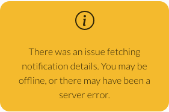
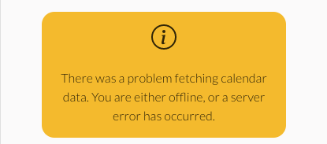
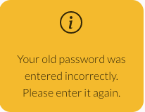

# TribeHub

## Project goals
TribeHub is designed to be a virtual equivalent to the typical wall planner a family might put up in a kitchen or other communal area. The primary goals of the web app are to:
1) Provide busy families with a single, central hub around which to plan and organise busy lives and schedules. This should include calendar/event scheduling functionality similar to a family wall planner, enabling events to be scheduled for one or multiple family members, and viewed by all the family.
2) Deliver a simple and intuitive user experience, suitable for adults and tech literate children aged 10+. 
3) Offer a minimal set of impactful features chosen in order to deliver a useful app within an achievable development timeframe, while laying a solid foundation for additional features in the future.

## Table of contents

## User stories
Themes, epics, user stories and testing outcomes are documented in the `user_stories` worksheet of [this Google sheet](https://docs.google.com/spreadsheets/d/11wcDHeqr85VaHXdJjATod_WECRY03IRUlGgT_L_ikIw/edit#gid=0).

### Themes
Themes were developed using the project goals as a starting point. These included:

- Account management - necessary to support the use of the app on an individual basis and to group users together into a 'tribe' to support goal 1.
- Calendar/event scheduling - central to the requirement to enable the key functionality required by goal 1.
- Family contacts - chosen as a feature with low implementation over-head to be included in an initial set of minimal functionality in support of goal 3.
- Shopping lists - chosen as a 'nice to have' feature which could be implemented for version 1 of the project given sufficient time, but which is also a discrete area of functionality which could be added later as per goal 3.
- Meal planning - also chosen as a 'nice to have' feature which could be added in a future version of the app, aligning with goal 3. This functionality would likely build on that of the shopping lists feature, and was therefore regarded as unlikely to be included in version 1.
- User feedback and information - required to support goal 2.
- Search and filter - required to support goal 2.

### Epics
Themes were then refined into the following epics:

- Account management
  - Account registration
  - Account sign-in
  - Account sign-out
  - Account deletion
  - User profile
- Calendar/event scheduling
  - Scheduling events
  - Event responses
  - Event deletion
  - Editing events
- Family contacts
  - Adding family contacts
  - Amending family contacts
  - Deleting family contacts
  - Viewing family contacts
- Shopping lists
  - Creating shopping lists
  - Amending shopping lists
  - Deleting shopping lists
- Meal planning
  - Creating a meal plan
  - Editing a meal plan
  - Deleting a meal plan
- User feedback/information
  - Notifications
  - User feedback
- Search and filter
  - Searching calendar events
  - Searching contact list
  - Searching shopping lists
  - Searching meal plans

### User stories
User stories required to implement each epic were created. These were categorised according to whether they were 'must have' features required to implement a Minimum Viable Product (MVP).
Please see the [Google sheet](https://docs.google.com/spreadsheets/d/11wcDHeqr85VaHXdJjATod_WECRY03IRUlGgT_L_ikIw/edit#gid=0) for detail.

## Agile development methodology
GitHub issues and projects were used to document and track an agile development approach.
A GitHub issue was created for each user story, with a label to indicate if they were required for the MVP. A GitHub milestone was created to represent the product backlog. All user stories were initially added to the product backlog.

Development work was scheduled using a series of iterations each with a timebox of three working days, representing a total 16 story points (although the duration of each iteration in calendar days was variable due to fitting the three working days around work and other commitments).

A GitHub project board was created for each iteration, and user stories moved from the product backlog into the relevant iteration as each cycle of work began. User stories were labelled as 'must have', 'could have' or 'should have' for goals for that specific iteration, and assigned story point values.  Story points for 'must have' user stories never exceeded 9 (60%). Some iterations also contained 'tasks' for activity not represented as user stories, such as setup/configuration and design/styling.

A project kanban board was used to track progress, with user stories moved between 'Todo', 'In Progress' and 'Done' columns as appropriate. For example, the iteration 4 project board was captured at the start, in the middle and at the end:

    
    
    

The project boards in their final form can be accessed at [TribeHub GitHub Project Boards](https://github.com/andy-guttridge/tribehub_react/projects?query=is%3Aopen).

Additionally, Notion was used to note and track other miscellanious tasks as they arose during development. The Notion tasks list can be accessed [here](https://www.notion.so/968f16ba28c94562b34767b616e31cd5?v=58c1cd844948493aa55f70f9458130b2&p=f16bfd5c78cd4bc4b4370cf6dd944a09&pm=s).

## Planning

### Mockups

Wireframes were produced based on those user stories that had been identified as required for the MVP.
These were based on a mobile view of the site, as TribeHub is very much a mobile first web app.

    

    <a href="readme_assets/pp5_wireframes.pdf" target="_rel">Link to fullsize wireframes</a>

The wireframes were critical to the development of the site and were invaluable in terms of mapping and visualising the 'flow' through the site and the UI, however the final product varies from the wireframes in a number of respects, largely for technical and/or usablility reasons:

- There is no modal dialog to confirm the user wishes to sign-out. This was omitted as signing out is a non-destructive action and sign-in requirements are minimal, so an additional modal was deemed unnecessary. 
- There is no modal dialog to confirm the user wishes to decline an event. This was not included because the default state of an event is that users have not accepted the invitation. They can either choose not to accept the invitation (no action required), or accept it, and the UI includes a 'going/not going' button directly from notifications and/or calendar events, making it quicker and easier for the user to provide an initial response or change their minds from the notification or event than from a modal. This may be revisited in future if a more fully featured 'accept/decline' system is implemented (see future improvements below).
- Forms to add and edit events, contacts and tribe member details are presented in line with the other webpage elements, rather than in modals. Once implementation started, it quickly became apparent that enclosing such forms in modals could negatively impact usability on cramped mobile screens.
- Rather than have a separate button to delete a tribe, deletion of a tribe is tied to the deletion of the tribe administrator's account - i.e., if the tribe administrator wants to close all accounts associated with the tribe, they simply close their own account and all other accounts associated with the tribe are also closed. This approach was chosen to simplify the user experience. The tribe administrator can still close accounts of individual tribe members.
- A `select` form elements is used to invite tribe members when creating a new calendar event, rather than the avatar based interface depicted on the wireframes. This approach was chosen to speed development and implement the 'add new event' functionality within the required timeframe. This could be revisited/enhanced in future.
- The wireframes depict calendar events for a given day rendered in a 'popover' style element attached to the calendar cell. In the final implementation, events are rendered in a list under the calendar. The primary reason for this was again in order to deliver the MVP functionality within the required timeframe, however implementing a scrollable list underneath the calendar might also provide a better experience for mobile by virtue of being less cramped (for example, this approach is used within the iPhone Calendar app). This could be revisited in future.
- The landing page was simplified to include a hero image and a one line description of the site, in order not to provide users with a cluttered view of the site.
- The search forms for events and contacts are initially hidden and can be opened using a search button, unlike on the wireframes. This is because the final events search form is considerably larger than suggested on the wireframe, and not keeping it hidden in the initial page load state would significantly clutter the Tribe Home page. While the contacts search form is much smaller, the same approach was adopted for UI consistency.
- 'Accordians' were not used for the 'Settings' page, and Settings was renamed to 'My Account'. It quickly became apparent that using accordians here would lead to a very sparse screen, even on mobile, and would therefore introduce an additional layer of UI interaction with little or no benefit. The 'Settings' page title was changed after comments from family testers who felt that 'My Account' would be a better fit for the content.
- A coloured dot with high contrast against the background colour is used on calendar cells to indicate whether there are any calendar events on a given day, rather than colour coding. This is because the calendar already uses several colours to indicate the current day, whether a cell is selected etc, and introducing another colour to convey such key data to the user could cause accessability challenges for colour blind users.

### Data models
Data models were planned alongside the wireframes. These are documented in the read-me for the [TribeHub Django Rest Framework API](https://github.com/andy-guttridge/tribehub_drf).

## Design

### Colours
The primary design aim was to create a simple and functional appearance. One of the reasons the DaisyUI component library was chosen was because it includes a simple colour theming feature, allowing the developer to define any number of colour themes composed of a small number of colours with semantic class names. This approach was ideally suited to the desire for a clean and simple site.

A white background was chosen for the site's main theme, to maximise contrast and provide a clean, straighforward and uncluttered look.
Colour palettes from [Adobe Colour Wheel](https://color.adobe.com/create) were explored. A bold pink from the ['purples' theme by Anisha Thomas](https://color.adobe.com/My%20Color%20Theme%20-%20purples-color-theme-10167596) was chosen for its vibrancy - this is used as the site's 'primary' colour to indicate clickable UI items. The 'secondary' and 'accent' colours were then chosen to complement it, using the algorithms in Adobe Colour Wheel, and then darkening the colours to increase contrast against the background.

A secondary colour scheme was chosen for the site's dark mode. The aim for dark mode was to provide an understated, muted and undistracting look, suited to low lighting conditions and provided as an alternative for users who prefer a less colourful presentation.
The primary colour for dark mode is a light sky blue, chosen to stand out against the dark background while also being a 'restful' colour. The secondary and accent colours are two different shades of grey, chosen to be unobtrusive.

The main colour palettes used for light and dark modes are:

| Colour |Light mode value   |Dark mode value   |   |   |
|---|---|---|---|---|
|  Primary - used for logo and key UI elements |  #e5006a |  #add5f7 |   |   |
| Secondary - used for logo, notifications badge and calendar highlighting  | #9c13bf  |  #e6e6e6 |   |   |
|  Accent - used for section/page headings |  #215ba6 | #d8ebf2  |   |   |
|  Neutral - used for sub-headings |   #4a4a4a |  #ffffff |   |   |
|  Base-100 - main background colour |  #fbfbfb |  #1c1c1c |   |   |
|  Base-200 - darker background colour |  #f8f8f8 | #141414  |   |   |
|  Base-300 - second darker background colour |  #d6d6d6 | #141414  |   |   |

Additionally, while colours for the primary and secondary colours (when used as backgrounds) are automatically defined by DaisyUI, these were overidden for the light theme to resolve some contrast issues highlighted by the Wave accessability validator.

Likewise, two additional CSS classes (`.CalWeekendText` and `.CalTextBlack`) were defined especially for the dark mode theme, to resolve some contrast issues with the default calendar colour for weekend days against the dark background and with the light coloured text used for some highlighted cells against the already light primary, secondary and accent colours in dark mode.

### Fonts
Google fonts were used for the project.
Fredoka One was chosen for the TribeHub logo `<h1>` element and `<h2>` headings used for the main page/section headings. The aim was to find a fun, friendly yet clear and legible font, and was selected after trying a number of possibilities suggested in this [shapegrams blog post on 'Fun Fonts for Every Season'](https://shapegrams.com/fonts/).

Nunito was chosen for `<h3>` and `<h4>` elements (used as sub-headings within major pages/sections) because it is similar to Fredoka One, but has a 'thinner' look better suited to smaller headings.

Lato was chosen as a font for all non-heading text elements, based on its popularity as a highly legible font for web text content (e.g. https://fontandswatch.com.au/fonts/lato-font/#:~:text=Lato%20Font%20comes%20in%2018,1%20billion%20audiences%20per%20day.)

## Features
### Landing page with hero image
The landing page features an image and brief description of the function of the site. 

    

### Registration form
*User stories 1 and 2*

The registration form enables a user to open a new account with 'tribe administrator' status. As well as entering a user name and password for the account, the user is also asked to name their tribe. This page includes an alert which explains to a new user that they will be the tribe admin, and will be able to add members to their tribe when they've signed in.

    

### Sign-in form
*User stories 4 and 53*

The sign-in form enables a user to login using their user name and password.

    

### Header with welcome message, notifications menu and sign-out button
*User stories 6, 7, 27, 50 and 51*

The site header contains the logo/name of the site, a welcome message to provide clear feedback to the user that they are signed in and a sign-out button.

    

### Bottom navbar
The bottom navbar supports the mobile first nature of the site by providing easy and convenient navigation without having to reach for the top of the screen for users of small touchscreen devices. The three icons correspond to the 'Tribe Home', 'Contacts' and 'Account' pages.

    

### Drop-down notifications menu
*User stories 18, 19, 20, 27, 50 and 51*

The notification icon includes a badge to inform the user of the current number of notifications (or no badge if they have none).
Selecting the icon reveals a list of current notifications. The user can delete notifications and respond to event invitations directly from the list. Notifications are currently generated when a user is invited to a calendar event or a change is made to an existing event to which they are invited. Other notification types could be added in future.

    

### Home page with family calendar
*User stories 14, 15, 16, 17, 18, 19, 20, 22, 23, 25, 54, 55, 56 and 57*

The Home page features the family calendar - this is the virtual equivalent of a kitchen wall planner. Days with meetings/appointmens ('calendar events') are marked with a line underneath the date (or a dot on larger displays). The user can select a given day to see a list of events for that day underneath the calendar (or to the side on large displays).
The user can view the next or previous month using the inner chevron buttons to the left and right of the month and year name. The outer chevron buttons allow the user to skip forward or backwards a whole 12 months.

    

### Add event and search buttons
*User stories 14, 54, 55, 56 and 57*

The add event button opens a form for the user to add a new calendar event, and the search button opens a form to search/filter events.
These are visible underneath the calendar in the above screnshot.

### Calendar events detail displayed below calendar
*User stories 18, 19, 20, 22, 23 and 25*

When the user selects a day with events in the calendar, or performs a search with valid results, all relevant events are displayed in a list below the calendar (or to one side for large screens).

The events include an icon to represent the category of the event (like the stickers on a wall planner), the 'subject'/title of the event, avatars of the originating user and those who have been invited, the start and end dates and a further details 'collapsible' element to reveal who originated the event, who is invited to it and who has accepted the invitation. 
The avatars of users who have not accepted the invitation a 'greyed out', while those who have accepted are coloured. If more than four users have been invited to an event, a circular avatar indicating the number of users over four (e.g. '+2' if there are six invited in total) is displayed.

If the current user is invited to an event, 'not going/going' buttons are shown to enable them to respond to the invitation.

    
    

### Edit event and delete event buttons
*User stories 22, 23 and 25*

Each calendar event can include an edit and delete button (visible in the screenshot above). These are only available for the user who originated the event, and the tribe admin (who has permission to edit and delete all of the family's events). Selecting the edit button opens the edit event form, and the delete button opens a modal dialog asking the user to confirm whether they wish to delete the event.

### Add event form
*User stories 14, 15, 16 and 17*

Selecting the add event button opens a form enabling the user to add a new calendar event. The form includes the following fields:

- To - a list of the other members of the user's tribe who can be invited to the event.
- Date and time - to select the start date and time of the event.
- Duration - to select the duration of the event. This is a dropdown list pre-populated with choices of 30 minutes, 1 hour, 90 minutes, 2 hours, 3 hours, 4 hours, 5 hours and 6 hours.
- Repeat - to allow the user to specify daily, weekly, two weekly, monthly or yearly recurrences.
- Subject - the subject or title of the event.
- Category - allows the user to select a category for the event from choices of Celebration, Club, Education, Medical, Music, Outing, Other, Pets, Shopping, Sport, Vacation, Work and None. The category determines the icon shown on the event.

The form also includes cancel and submit buttons.

    

### Edit event form
*User story 23*

The edit event form is identical to the add event form, but is pre-populated with the data for the relevant event, enabling the originator of the event or the tribe admin to edit the details and save to the database.

    

### Family contacts page
*User stories 30, 31, 32, 33 and 58*

The family contacts page displays a list of contacts for the family. These can be viewed by all members of the tribe, and only the tribe admin can add, edit or delete contacts.

    

### Add contacts and search contacts buttons
*User stories 30 and 58*

These two buttons are visible in the screenshot above. The add contact button is only visible to the tribe admin, and opens a form to add a new contact.
All members of the tribe can access the search contacts button, which opens a simple form to perform a text search on the contacts list.

### Add contacts form
*User story 30*

The add contact form enables the tribe admin to add a new contact to the family's list.
It includes the following fields:

- Category - this describes the nature or purpose of the contact, and is used as the heading for each contact in the contacts list. This is the only compulsory field on the form.
- Company - allows the tribe admin to record a company name, if relevant.
- Title - allows the tribe admin to record the title of a named contact, if relevant.
- First name - allows the tribe admin to record the first name of a named contact, if relevant.
- Last name - allows the tribe admin to record the last name of a name contact, if relevant.
- Telephone number - allows the tribe admin to record the phone number of a contact, if relevant.
- Email - allows the tribe admin to record the email address of a contact, if relevant.

The form also includes cancel and submit buttons.

    

### Search contacts form
*User story 58*

The search contacts form enables all members of the tribe to perform a simple text search of the contact list. All fields are matched against the search term by the API, and any results are shown underneath the form.

    

### Edit contact and delete contact buttons
*User stories 31 and 32*

Each contact can contain edit and delete buttons (visible in the screenshot above). These are only visible to the tribe admin.
The edit button opens the edit contact form, and the delete button opens a modal dialog asking the user to cancel or confirm the deletion.

### Edit contact form
*User story 31*

The edit contact form is identical to the add contact form, but is pre-populated with the data for the relevant contact and enables the tribe admin to make changes and save them to the database.

    

### Account page with My Tribe, My Profile, Change Password and Delete Account
*User stories 2, 8, 9 and 12*

The account page includes several sub-sections. For normal users these are My Profile, Change Password and Delete Account.
In addition, the tribe admin has the My Tribe section.

### My Tribe
*User stories 2 and 8*

This section includes a list of tribe members with their avatars, display name and a delete button, enabling the tribe admin to remove any members from the tribe and close their accounts. The delete button opens a modal dialog asking the user to cancel or confirm the action.

    

The My Tribe section includes an add tribe member button, which opens a form enabling the tribe admin to add new tribe members.
This requires entering a username and password (the new tribe member can change their own password later).

    

### My Profile
*User story 12*

This section enables the user to preview and upload a profile image, and change their display name. The display name is is used to represent the user throughout the app (e.g. on calendar invitations), and when a new account is created this is set to the username, but can be freely changed.

    

### Change password
This enables the user to change their password. They are required to enter the new password twice to ensure a match, along with their old password - these fields validated by the REST API to ensure the two new password fields match and that the old password is correct. An error alert is displayed if the form values do not pass validation.

    

### Delete account
*User story 9*

This section enables the user to delete their account. Selecting the button opens a modal dialog asking the user to cancel or confirm.
If the user confirms, their account is made inactive in the database, their profile deleted, and any events they have created are also deleted.

If the user deleting the account is the tribe admin, all user accounts associated with the tribe are made inactive, all their profiles deleted and all other data associated with the tribe is deleted. This action effectively 'shuts down' the whole tribe. Tribe admin users are presented with a specific warning of this above the delete button and in the modal.

    

### Modal dialogs to confirm or cancel destructive actions
All user actions that result in a permanent deletion of data trigger a modal dialog offering the opportunity to cancel or confirm.

    
    
    
    

### 'Single page mode' for medium and large screen sizes
Early in development, it became apparent that while the content and design of the web app was very well suited to mobile devices, each of the separate pages would appear very sparse on larger displayes (e.g. tablet and desktop).
It was then decided to display the Tribe Home, Account and Profile pages as sections on a single page for screens of 768px width and above. The bottom navbar is not present when the app is in 'single page mode'. This was implemented using a custom `useSinglePage` hook, which any component within the app can access to determine whether the app is currently in single page mode and render itself appropriately.

For both tablets (768px breakpoint) and large devices (1024px breakpoint) calendar events are embedded in a scrolling div in order to avoid long lists of events above the Contacts and Account sections. This appears underneath the calendar for tablets, and to the right of the calendar for large devices.

TribeHub is very much a mobile first web app, and the experience for tablet and desktop users could be improved further (see the section on future features below).

    
    

### Prompts for new users
The Contacts and Account pages include prompts for tribe admins who have just opened an account to aid them with setting their tribe up.

    
    

### Success messages
The web app includes a series of success alerts to inform the user when a request resulting in a change create, update or delete action in the database has been successful.
The only such action for which there is no explicit success message is accepting/declining invitations to events, as it was felt this would be intrusive and detrimental to the user experience. The 'not going/going' buttons provide some visual feedback themselves, and the user will see an error message if an attempt to respond to an event invitation fails.

    
    
    
    
    
    
    
    
    

### Error messages
TribeHub includes error alerts which are presented in the event a create, update or delete action fails (including data validation errors received from the REST API) and if there are any issues fetching data. A sample of error messages is shown below (these do not include every single permutation).

    
    
    
    

### Darkmode
The web app features a darkmode which is activated depending on the user's browser or system settings.

    
    
    

### Re-use of components
A number of reusable React components were created with the intention of reducing code duplication.

#### `Avatar.js`
Utilised to display user avatars in the `CalEvent.js` (displays calendar event details), `ProfileForm.js` (allows the user to preview and upload a new profile image) and `TribeMember.js` (used to display each tribe member in the My Tribe section) components. 

It accepts `small` and `large` props which allow any other component which embeds it to request small or large versions (it renders itself in a medium size if neither of these props is present). 

It also accepts an `accepted` prop with a `true` or `false` value - if it receives false the avatar is rendered in grey scale, otherwise in colour. This is used to provide visual indicator of whether a tribe member has accepted a calendar event in the `CalEvent.js` component. Finally, it also accepts a `displayName` prop which is used to provide an `alt` attribute for the image.

#### `ConfirmModal.js`
Used for the various cancel/confirm modal dialogs which are displayed when the user requests to perform a destructive action. Props it accepts include `heading` for the modal title; `body` for the modal body text; `cancelHandler` for handler function for the cancel button; and `confirmHandler` for a handler function for the confirm button.

#### `NotificationItem.js`
Used to render multiple instances of notifications in the notification menu. Props include `notification` for the notification details from the REST API; `notificationsChanged` and `setNotificationsChanged` which are used to toggle a boolean value to communicate to the parent component that the state of the notification has changed, for example if the user accepts or declines an event directly from the notification; `handleDeleteButton` for a handler function for the user deleting the notification and `notificationId` which is used to generate unique HTML `id` attributes for the buttons in the component and to communicate which notification has been deleted to the delete handler.

#### `Spinner.js`
Used to render the loading spinner utilised throughout the app. It accepts a `small` prop which a parent component can use to request the spinner is rendered in small size.

#### `Account.js`
Used for the main Account page in the mobile view, and also for the Account section in single page mode. It uses the `useSinglePage` custom hook to determine which CSS styles to use.

#### `TribeMember.js`
Multiple instances of this component represent tribe members in the My Tribe section of the Account page/section. It accepts `tribeMember` and `handleDeleteButton` props, which contain the details of the tribe member to be rendered and a handler for the delete button.

#### `Contacts.js`
Used for the main Contacts page in the mobile view, and for the Contacts section in single  page mode. It uses the `useSinglePage` custom hook to determine which CSS styles to use.

#### `Contact.js`
Multiple instances of this component represent contacts in the Contacts page/section. It accepts props including `contact` for the details of the contact to render; `didSaveContact` and `setDidSaveContact` which toggle a boolean value to inform the parent component that a change to  the state of the contact has taken place (e.g. it has been edited), `handleDeleteButton` which accept a handler for the user selecting the delete button for the specific contact; and `setActionSucceeded` which is used to set the value of a success alert message in the parent component.

#### `ContactDetailsForm.js`
Used for both the add contact and edit contact forms in the Contacts page/section. Props include `handleCancelButton` for a handler function; `didSaveContact` and `setDidSaveContact` which are used to inform the parent component that the state of a contact (if being edited as opposed to created) has changed; `isEditingContact` which the parent uses to tell the component whether it is being used to edit an existing contact or create a new one (this informs whether the form has to be populated with existing data, form submission behaviour and the title at the top of the form); `contact` for the details of the contact to be rendered and `setActionSucceeded` which is used to set the value of a success alert message in the parent.

#### `CalEvent.js`
Multiple instances represent calendar events in the Home page/section. It accepts props including `event` for the details of the event to be rendered; `didSaveEvent` and `setDidSaveEvent` which are used to inform the parent component that the state of an existing calendar event has changed; `handleDeleteButton` for delete button handler function; `calEventId` which is used to provide unique HTML id attribute values for buttons and other elements (the calendar event id from the API is unsuitable for this, as it may be shared between an original event and its recurrences, which may be displayed at the same time e.g. in search results) and `setActionSucceeded` which is used to set the value of a success message alert in the parent component.

#### `EventDetailsForm.js`
Used for the add event and edit event forms in the Home page/section. Props include `handleCancelButton` for a handler function; `didSaveEvent` and `setDidSaveEvent` to inform the parent of a change to the state of the event if it has been edited; `isEditingEvent` which informs the component if it is being used to edit an existing event as opposed to create a new one (this affects whether the form needs to be populated with an existing event, form submission behaviour); `event` which contains details of the event being edited (if applicable); `defaultStartDate` which is used to populate the default form value for the start date of a new event (the parent passes in the current calendar day) and `setActionSucceeded` which sets the value of a success message alert in the parent.

### React features enhancing user experience
**ILO 2.1**

### CRUD functionality

### Future improvements and features

#### Future improvements

#### Future features

## Frameworks, libraries and dependencies
**Need to document rationale for choices**

### Tailwind CSS

### DaisyUI

### React Bootstrap Icons

### React Router

### Axios

### JWT Decode

### React-Calendar

## Testing

### Manual testing

### Automated testing

### Validator testing

### W3C HTML Validator

### W3C CSS validator

### ESLint JavaScript validator

Issues corrected include: unnecessary semi-colons at the end of statements, unescaped apostrophies in html text, unused variable, missing React import statements

### Lighthouse testing

Lighthouse testing revealed that button elements did not have id attributes which are required by assistive technologies. These were added to all buttons, with programatically generated unique values where required for components which are rendered multiple times.

### Accessability testing

Wave testing revealed contrast issues with buttons. The text colour for buttons in the primary and secondary colour was lightened, while outline buttons were changed from primary to a dark (or light for dark mode) colour, and the font size was increased for all buttons. This resolved the contrast issues.

Contrast issues were also detected between the dots on the calendar indicating where there are events for a given day. This was more difficult to address, because the calendar cells can have a number of different colours depending on their current state. After some experimentation, the `mix-blend-mode` attribute with a value of `difference` was used on these elements to invert their colour against that of the background. This means the colour of these indicators might not fit as well with the colour scheme of the site, but it guarantees there will be no contrast issues.

Three further contrast errors were found, but these were ignored as they apply to hidden elements which provide additional information for screen readers.

Wave testing also highlighted that avatar images throughout the website had the same text for the alt attribute. This was addressed by passing a `displayName` prop through to the Avatar component, and using this to generate an appropriate alt text value for each user.

The Wave validator also several form elements with no label on the profile update form and the event search form (caused by a missing or incorrect ids on input elements), and one element with a duplicate id on the contacts form (caused by a naming clash with another element on the add event form).
The label containing the notifications indicator was found to contain no text. This was rectified by putting a `` element with the Tailwind CSS `sr-only` class inside the label, providing a read out of the number of notifications present for screen readers but visually hidden. This label was also flagged as orphaned from its form control by the Wave validator, however this was not fixed, as the label is used instead of a button for the DaisyUI dropdown component in order to overcome a bug with Safari.

Missing labels were found for the input elements which are part of the DaisyUI collapse components used to reveal further detail for each calendar event. This was rectified by passing the unique key value generated for each CalEvent instance as a `calEventId` prop, using this to generate a unique id for each input and associating a screen reader only label to each one.

The Wave report contained an alert about the `noscript` element. This was to flag that content within this element must be accessible. Since the element contains a simple text reminder that JavaScript must be enabled to use the website, this was deemed not to be an issue.

Wave flagged skipped heading levels in the notification items menu and on calendar events. The former was addressed by changing the `h3` elements used in the `NotificationItem` component to `h2` and styling to look like `h3`. The headings for event titles on calendar events were changed from `h4` to `h3`, which would appear to be correct as the next heading above them is an `h2`, however this did not resolve the validator error. `h2` and `h1` were also tested for these headings, but this still did not resolve the error. These elements were then changed to `p` and the error was resolved. The `h5` headings within the 'details' collapse component at the bottom of calendar events were also changed to `p` elements to resolve similar errors.

The wave report that the category icons on calendar events did not have unique text for the `alt` attribute. This was due to a bug rather than an oversight, and was corrected. Wave then flagged a 'redundant alternative text' alert, meaning that another nearby element had an image with the same `alt` text. This is because more than one event in the list of events had the 'shopping' category - given the purpose and meaning of the icon, a repeat occurence of the alt text is correct and was deemed not to be an issue.

### Resolved bugs
- During implementation of the `NotificationItem` component, requests to the REST API for the data for the events with which each notification is associated were frequently resulting in an HTTP 500 internal server error. A version of the API running on a development server was used for debugging. This revealed that the number of simultaneous requests for data coming from a large number of NotificationItems was overwhelming the free tier ElephantSQL database server. The fix was to add the full data for each event to the notification JSON served by the API, which meant that only one network request was required to fetch the notification and event data together. 
- During testing, a large amount of empty space was noted at the bottom of each page, but only for some user accounts. No elements causing this could be identified using the Chrome developer tools, and elements were manually removed from each component until the culprit was found. This revealed that the unordered list of norifications inside the DaisyUI dropdown component used for the notifications menu was taking up vertical space in the document even when closed/not visible. This was only noticeable for users with a large number of notifications and hence a very long list inside the menu. The issue was addressed by applying the Tailwind CSS hidden class to the unordered list when not visible. An event listener was added to detect clicks outside of the menu and close the list accordingly.

### Unresolved bugs

## Deployment

## Credits

### Code
- How to use the React Router `<BrowserRouter>` component to provide history context to `<Router>` components from [this Stack Overflow article](https://stackoverflow.com/questions/65425884/react-router-v6-error-useroutes-may-be-used-only-in-the-context-of-a-route)
- Technique to use an event handler to store the current size of the window in state variables in order to conditionally render components adapted from [this Stack Overflow question](https://stackoverflow.com/questions/62954765/how-to-do-conditional-rendering-according-to-screen-width-in-react)
- Code to handle current user context in `src/contexts/CurrentUserContext.js` adapted from Code Institute 'Moments' React walkthrough lessons
- Code to create and use axios interceptors to refresh tokens in `src/contexts/CurrentUserContext.js` and `src/utils/utils.js` adapted from Code Institute 'Moments' React walkthrough lessons
- The technique to add modal dialogs to the end of the body element in the DOM is from [upmostly.com](https://upmostly.com/tutorials/modal-components-react-custom-hooks)
- How to use the `:global` selector in CSS to ensure styles are overriden in a React component from [Stack Overflow](https://stackoverflow.com/questions/42191671/css-modules-reactjs-parent-and-child-css-classes-in-different-components)
- How to use `require` to ensure webpack processes local images is from [Stack Overflow](https://stackoverflow.com/questions/34582405/react-wont-load-local-images)
- How to use CSS filters to colour a SVG is from [Stack Overflow](https://stackoverflow.com/questions/22252472/how-can-i-change-the-color-of-an-svg-element)
- How to define a CSS class as part of a DaisyUI theme is from [GitHub](https://github.com/saadeghi/daisyui/discussions/640)
- How to iterate over they keys of a JavaScript object in React is from [Stack Overflow](https://stackoverflow.com/questions/40803828/how-can-i-map-through-an-object-in-reactjs)
- Technique for handling multiple selection elements in controlled React forms is from [Stack Overflow](https://stackoverflow.com/questions/50090335/how-handle-multiple-select-form-in-reactjs)
- How to correctly use the useCallback hook to declare a function outside of useEffect and call from inside useEffect to enable code reuse is from [Stack Overflow](https://stackoverflow.com/questions/56410369/can-i-call-separate-function-in-useeffect)
- How to add a number of minutes to a DateTime object is from [StackOverflow](https://stackoverflow.com/questions/1197928/how-to-add-30-minutes-to-a-javascript-date-object)
- Technique for using a timer to prevent excessive network requests when the values of input elements on a search form change is from the Code Institute Moments walkthrough project
- How to redirect to an appropriate page when the user enters an invalid URL using the Navigate component from React-Router-DOM has been adapted from [copycat.dev](https://www.copycat.dev/blog/react-router-redirect/)
- How to use Google Fonts in a Tailwind CSS project is from [daily-dev-tips.com](https://daily-dev-tips.com/posts/using-google-fonts-in-a-tailwind-project/)
- How to invert the colour of an element compared to its background is from [Stack Overflow](https://stackoverflow.com/questions/17741629/how-can-i-invert-color-using-css)
- How to create divs with diagonal lines is from [9elements.com](https://9elements.com/blog/pure-css-diagonal-layouts/)
- How to use the text-shadow CSS attribute to add an outline to text is from [Stack Overflow](https://stackoverflow.com/questions/57464935/font-outline-using-only-css)

The following documentation was referenced extensively throughout the project:

- [React Router Documentation](https://v5.reactrouter.com/)

### Media
- Placeholder screenshots image used on the wireframes by u_fg0tkeqgiy on [Pixabay](https://pixabay.com/vectors/view-web-secure-image-ipad-laptop-7321141/).
- Hero image used on the landing page by Pexels on [Pixabay](https://pixabay.com/photos/child-couple-daylight-family-1844901/).
- Placeholder avatar image used on the wireframes and in the app by Stephanie Edwards on [Pixabay](https://pixabay.com/vectors/blank-profile-picture-mystery-man-973460/).
- Fidget spinner image used for loading spinner by b0red on [Pixabay](https://pixabay.com/vectors/fidget-spinner-add-a-d-spin-2304681/)
- Images used for event category icons:
  - Club icon used for club by Clker-Free-Vector-Images on [Pixabay](https://pixabay.com/vectors/clubs-cards-club-shape-card-games-33561/)
  - Mortar board icon used for education Clker-Free-Vector-Images on [Pixabay](https://pixabay.com/vectors/graduation-cap-graduation-education-311979/)
  - Medical bag icon used for medical by OpenClipart-Vectors on [Pixabay](https://pixabay.com/vectors/red-cross-aide-assistance-158454/)
  - Musical note icon used for music by ruhbastard on [Pixabay](https://pixabay.com/vectors/music-note-music-note-musical-notes-1967480/)
  - Metallic O icon used for other by Clker-Free-Vector-Images on [Pixabay](https://pixabay.com/vectors/english-alphabets-o-letters-15th-33793/)
  - Shopping trolley icon used for shopping by Clker-Free-Vector-Images on [Pixabay](https://pixabay.com/vectors/shopping-cart-caddy-shopping-trolley-304843/)
  - Volley icon used for sport by Clker-Free-Vector-Images on [Pixabay](https://pixabay.com/vectors/volleyball-sport-black-white-306791/)
  - Aeroplane icon used for vacation by GDj on [Pixabay](https://pixabay.com/vectors/jumbo-jet-airplane-aeroplane-1801305/)
  - Office desk icon used for work by OpenClipart-Vectors on [Pixabay](https://pixabay.com/vectors/computer-office-worker-typing-146329/)
  - Present icon used for celebration by chachaoriginal on [Pixabay](https://pixabay.com/vectors/red-icon-present-gift-wrapped-1902863/)
  - Car icon used for outing by Clker-Free-Vector-Images on [Pixabay](https://pixabay.com/vectors/car-automobile-sedan-four-door-car-35502/)
  - Cat icon used for pets by Lohrelei on  [Pixabay](https://pixabay.com/vectors/cat-kitten-sitting-silhouette-1144200/)
- Fonts:
  [Google Fonts Fredoka One](https://fonts.google.com/?query=fredoka+one&sort=popularity)
  [Google Fonts Nunito](https://fonts.google.com/specimen/Nunito?query=nunito&sort=popularity)
  [Google Fonts Lato](https://fonts.google.com/?query=lato&sort=popularity)
